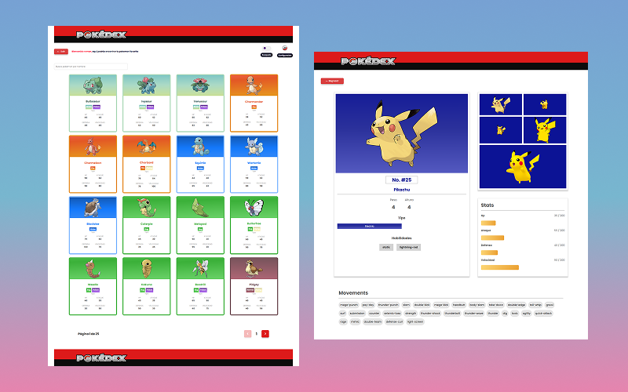

# PokemonApp 😺 - Pokedex Web

Aplicación web construida con React que consume la API pública de PokeAPI. Permite explorar y buscar Pokémon con funcionalidades como filtrado, paginación, búsqueda por nombre y diseño completamente responsivo para dispositivos móviles y de escritorio.



## Funcionalidades
* 🔍 Búsqueda por nombre de Pokémon.
* 🧪 Filtrado dinámico por tipos u otras características.
* 📄 Paginación para explorar de forma eficiente toda la colección.
* 📱 Diseño responsivo que se adapta a cualquier dispositivo.
* ⚡️ Consumo eficiente de datos usando TanStack Query (react-query).
* 🎯 Manejo global del estado con useContext.
* 🧭 Navegación fluida con React Router Dom.

## 🛠️ Tecnologías utilizadas

| Tecnología         | Descripción                                         |
|--------------------|-----------------------------------------------------|
| React              | Librería principal para construir la UI             |
| TypeScript         | Tipado estático en tiempo de desarrollo             |
| TanStack Query     | Manejo de peticiones y caché de datos               |
| React Router Dom   | Enrutamiento entre vistas                           |
| SASS               | Estilos con preprocesador                           |
| useContext         | Manejo del estado global sencillo                   |

## 📦 Instalación
Clona este repositorio:
```
git clone https://github.com/tu-usuario/pokeapp.git
```

Instala las dependencias:
```
npm install
```

Inicia el servidor de desarrollo:
```
npm run dev
```

## 🌐 API utilizada

<a href="https://pokeapi.co">PokeAPI v2:</a>
Se utiliza para obtener datos de Pokémon, tipos, habilidades y más.

